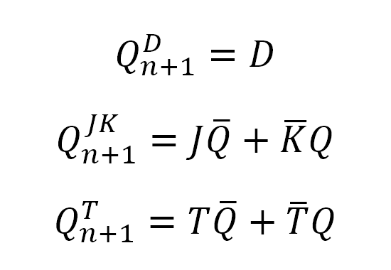

# FFs Pre-Lab

 

### D-Type FF
| clk | d | q(n) | q(n+1) | Comments |
| ----------- | ----------- | ----------- | ----------- | ----------- |
| ↑ | 0 | 0 | 0 | `q(n+1)` has the same level as `d` |
| ↑ | 0 | 1 | 0 | `q(n+1)` has the same level as `d` |
| ↑ | 1 | 0 | 1 | `q(n+1)` has the same level as `d` |
| ↑ | 1 | 1 | 1 | `q(n+1)` has the same level as `d` |

### JK-Type FF
| clk | J | K | q(n) | q(n+1) | Comments |
| ----------- | ----------- | ----------- | ----------- | ----------- | ----------- |
| ↑ | 0 | 0 | 0 | 0 | Output did not change |
| ↑ | 0 | 0 | 1 | 1 | Output did not change |
| ↑ | 0 | 1 | 0 | 0 | `K` sets the `q(n+1)` to `0` |
| ↑ | 0 | 1 | 1 | 0 | `K` sets the `q(n+1)` to `0` |
| ↑ | 1 | 0 | 0 | 1 | `J` sets the `q(n+1)` to `1` |
| ↑ | 1 | 0 | 1 | 1 | `J` sets the `q(n+1)` to `1` |
| ↑ | 1 | 1 | 0 | 1 | Simultanous `J` and `K` invert the output |
| ↑ | 1 | 1 | 1 | 0 | Simultanous `J` and `K` invert the output |

### T-Type FF

| clk | t | q(n) | q(n+1) | Comments |
| ----------- | ----------- | ----------- | ----------- | ----------- |
| ↑ | 0 | 0 | 0 | Output did not change |
| ↑ | 0 | 1 | 1 | Output did not change |
| ↑ | 1 | 0 | 1 | `t` inverts output |
| ↑ | 1 | 1 | 0 | `t` inverts output |