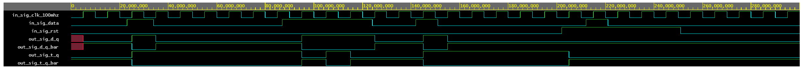
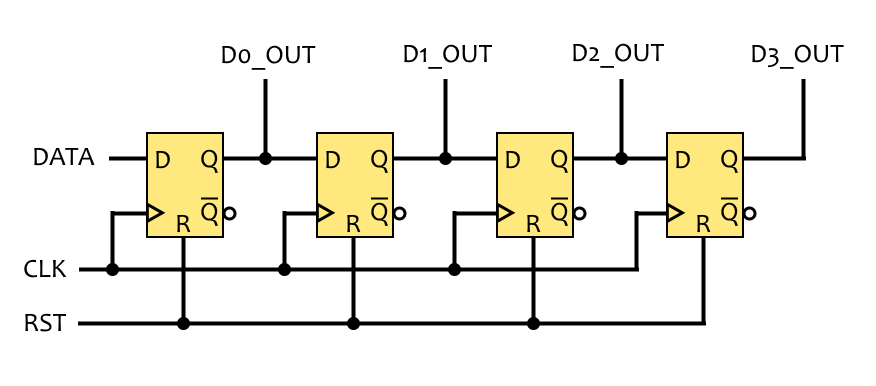
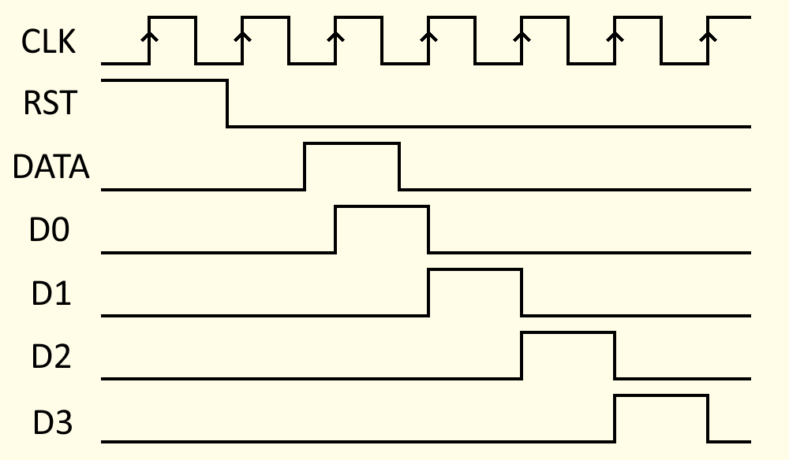

# Lab 5: Mykyta Syskov

### D & T Flip-flops

1. Screenshot with simulated time waveforms. Try to simulate both D- and T-type flip-flops in a single testbench with a maximum duration of 200 ns, including reset. Always display all inputs and outputs (display the inputs at the top of the image, the outputs below them) at the appropriate time scale!

   

### JK Flip-flop

1. Listing of VHDL architecture for JK-type flip-flop. Always use syntax highlighting, meaningful comments, and follow VHDL guidelines:

```vhdl
architecture Behavioral of jk_ff_rst is

signal jk_mem : STD_LOGIC :='0';

begin
    jk_ff_rst : process (clk)
    begin
        if rising_edge(clk) then
        
            	if (J = '1' and K = '0') then
                	jk_mem <= '1';
                    
                elsif (J = '0' and K = '1') then
                	jk_mem <= '0';
                    
                elsif (J = '1' and K = '1') then
                	jk_mem <= not jk_mem;
                    
                end if;
         end if;
    end process jk_ff_rst;
    
    q <= jk_mem;
    q_bar <= not jk_mem;

end architecture Behavioral;
```

### Shift register

1. Image of `top` level schematic of the 4-bit shift register. Use four D-type flip-flops and connect them properly. The image can be drawn on a computer or by hand. Always name all inputs, outputs, components and internal signals!

   
   
